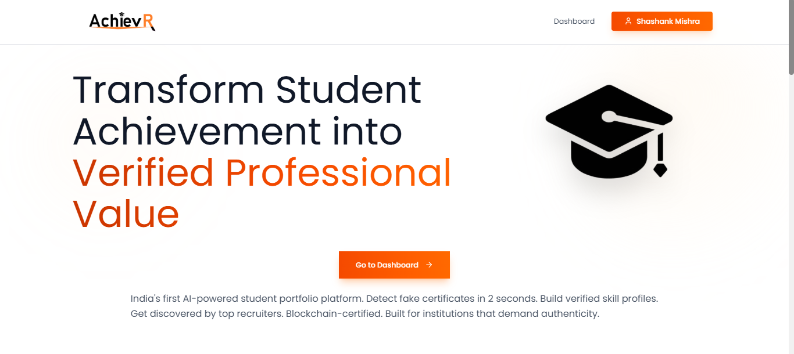
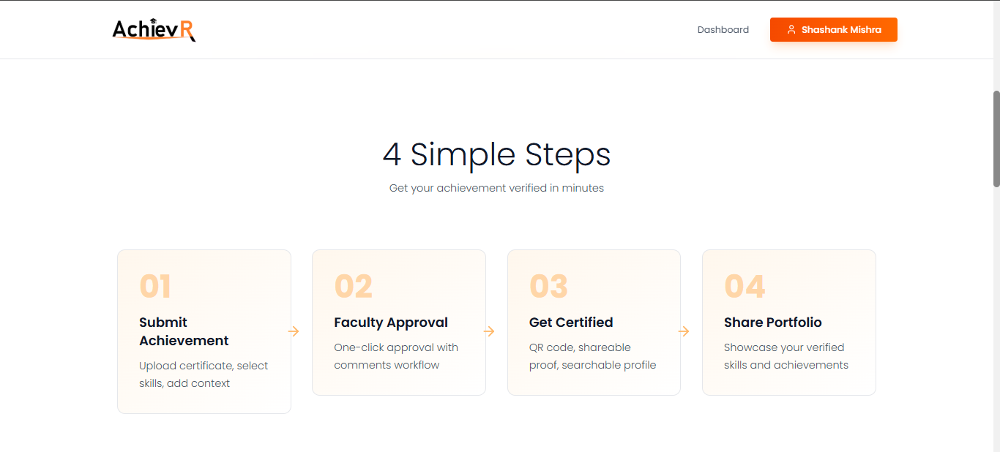
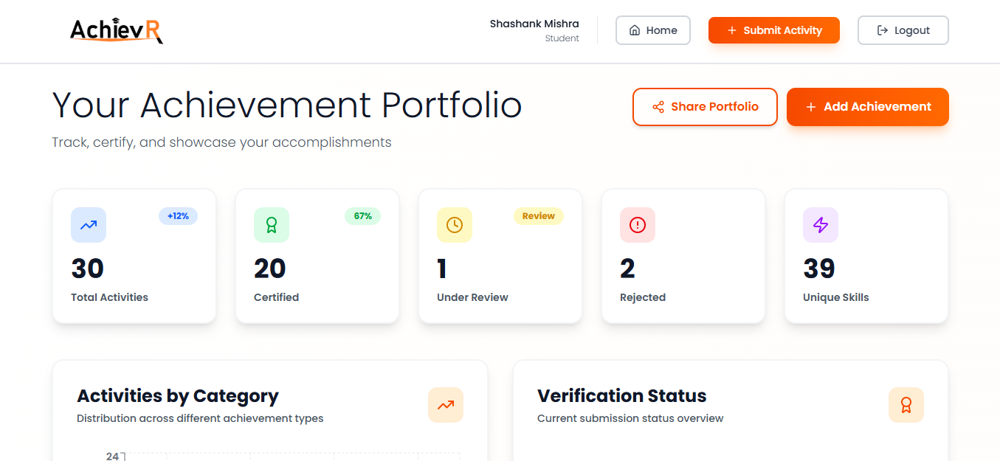
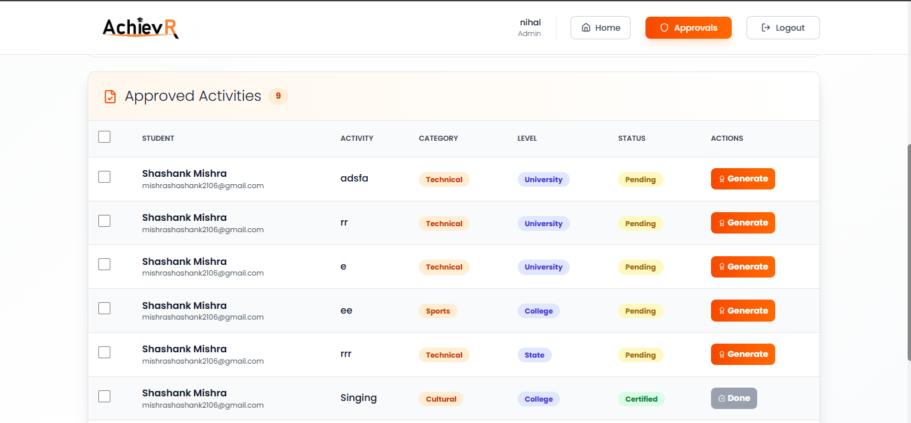

# AchievR - Student Achievement Verification Platform

> **Transform student achievements into verified, blockchain-ready professional credentials**

**Live:** [achievr-demo.vercel.app](#) 

---

## Table of Contents

- [Overview](#overview)
- [Features](#features)
- [Tech Stack](#tech-stack)
- [Getting Started](#getting-started)
- [Project Structure](#project-structure)
- [API Documentation](#api-documentation)
- [Screenshots](#screenshots)
- [Contributing](#contributing)
- [License](#license)
- [Team](#team)

---

## Overview

**AchievR** is an enterprise-grade credential verification platform that eliminates manual certificate validation for educational institutions. Built for **HackOMania 2025**, it reduces verification time from weeks to seconds using QR-verified digital certificates.

### Problem Statement

- Students maintain scattered achievements across emails, certificates, and documents
- Institutions spend weeks manually verifying credentials for placements/admissions
- Recruiters face 30%+ fake certificate fraud in hiring
- Accreditation bodies (NAAC/NBA) demand centralized activity tracking

### Our Solution

AchievR provides a **single source of truth** for student achievements with:
- Faculty-approved digital portfolios
- QR-code certificate verification (2-second validation)
- Recruiter-facing public profiles
- Institutional analytics dashboards

---

## Features

### For Students
- **Unified Portfolio** - Track academic, technical, sports, and cultural achievements
- **Smart Skill Tagging** - 60+ predefined competencies + custom skills
- **Instant Certificates** - QR-verified digital credentials
- **Shareable Profiles** - Public portfolio links for recruiters

### For Faculty
- **One-Click Approval** - Review and approve student submissions
- **Proof Document Validation** - View/download supporting evidence
- **Bulk Certificate Generation** - Automated QR certificate creation
- **Activity Analytics** - Track department-wise participation

### For Institutions
- **Multi-Role Access** - Student/Faculty/Admin dashboards
- **Real-Time Reporting** - NAAC/NBA-ready analytics
- **Email Automation** - Nodemailer-powered notifications
- **Scalable Architecture** - Handles 1000+ concurrent submissions

---

## Tech Stack

### Frontend

React 18          - Component-based UI architecture
Tailwind CSS      - Utility-first responsive design
React Router      - Protected route management
Recharts          - Analytics visualizations
Lucide React      - Modern icon library
Axios             - HTTP client for API calls

### Backend

Node.js           - JavaScript runtime
Express.js        - RESTful API framework
MongoDB           - NoSQL database
Mongoose          - ODM for schema modeling
JWT               - Stateless authentication
Bcrypt            - Password hashing
Nodemailer        - Email automation
Multer            - File upload handling

### DevOps & Tools

Git/GitHub        - Version control
Postman           - API testing
VS Code           - Development environment
Vercel/Netlify    - Frontend deployment (planned)
Railway/Render    - Backend deployment (planned)

---

## Getting Started

### Prerequisites
bash
Node.js >= 16.x
MongoDB >= 6.x
npm or yarn

### Installation

**1. Clone the repository**
bash
git clone https://github.com/OmkarMishr/HackTitans-AchievR.git
cd HackTitans-AchievR

**2. Setup Backend**
bash
cd backend
npm install

# Create .env file
cp .env.example .env
# Edit .env with your MongoDB URI, JWT secret, email credentials

**3. Setup Frontend**
bash
cd ../frontend
npm install

**4. Run Development Servers**

**Terminal 1 - Backend:**
bash
cd backend
npm start
# Server runs on http://localhost:5000

**Terminal 2 - Frontend:**
bash
cd frontend
npm run dev
# App runs on http://localhost:3000

**5. Access the Application**

Frontend: http://localhost:3000
Backend:  http://localhost:5000/api

---

## Project Structure

HackTitans-AchievR/
├── backend/
│   ├── models/              # Mongoose schemas
│   │   ├── User.js
│   │   ├── Activity.js
│   │   └── Certificate.js
│   ├── routes/              # Express routes
│   │   ├── auth.js
│   │   ├── activities.js
│   │   └── certificates.js
│   ├── middleware/          # Auth & validation
│   ├── uploads/             # File storage
│   ├── .env                 # Environment variables
│   └── server.js            # Entry point
│
├── frontend/
│   ├── src/
│   │   ├── components/
│   │   │   ├── Navbar.jsx
│   │   │   ├── SkillSelector.jsx
│   │   │   └── ...
│   │   ├── pages/
│   │   │   ├── StudentDashboard.jsx
│   │   │   ├── FacultyDashboard.jsx
│   │   │   ├── SubmitActivity.jsx
│   │   │   └── ...
│   │   ├── App.jsx
│   │   └── main.jsx
│   ├── public/
│   └── package.json
│
└── README.md

---

## API Documentation

### Authentication Endpoints

**POST** `/api/auth/register`
json
{
  "name": "John Doe",
  "email": "john@university.edu",
  "password": "securepass123",
  "role": "student"
}

**POST** `/api/auth/login`
json
{
  "email": "john@university.edu",
  "password": "securepass123"
}

### Activity Endpoints

**GET** `/api/activities/my-activities`  
Headers: `Authorization: Bearer <token>`

**POST** `/api/activities/submit`
json
{
  "title": "Hackathon Winner",
  "category": "Technical",
  "description": "Won first prize...",
  "eventDate": "2025-01-15",
  "selectedTechnicalSkills": ["React", "Node.js"],
  "proofDocuments": [...]
}

**PUT** `/api/activities/:id/approve`  
Headers: `Authorization: Bearer <faculty-token>`

### Certificate Endpoints

**POST** `/api/certificates/generate/:activityId`  
**GET** `/api/certificates/verify/:certificateId`  
**GET** `/api/certificates/download/:certificateId`

---

## Screenshots

### Landing Page

### Call To Action

### Student Dashboard

### Certificate Generation

---

## Key Highlights

95% Faster Verification    - Weeks → 2 seconds
Enterprise Security        - JWT + Bcrypt + Role-based access
Real-Time Analytics        - Recharts dashboards
Automated Workflows        - Nodemailer email notifications
Mobile-First Design        - Tailwind CSS responsive UI
QR Verification           - Instant credential validation

---

## Roadmap

- [ ] Deploy to production (Vercel + Railway)
- [ ] Blockchain integration for immutable certificates
- [ ] AI-powered skill extraction from descriptions
- [ ] Multi-institution white-label deployment
- [ ] LinkedIn/Naukri.com API integration
- [ ] Mobile app (React Native)

---

## Contributing

We welcome contributions! Please follow these steps:

1. Fork the repository
2. Create feature branch: `git checkout -b feature/amazing-feature`
3. Commit changes: `git commit -m 'Add amazing feature'`
4. Push to branch: `git push origin feature/amazing-feature`
5. Open Pull Request

---

## License

This project is licensed under the MIT License - see [LICENSE](LICENSE) file.

---

##  Team - Hack Titans

| Name | Role | GitHub | LinkedIn |
|------|------|--------|----------|
| **Shashank Mishra** | Full Stack Developer | [@shashankmishra21](https://github.com/shashankmishra21) | [LinkedIn](https://www.linkedin.com/in/mishrashashank2106/) |
| **Omkar Mishra** | Full Stack Developer | [@OmkarMishr](https://github.com/OmkarMishr) | [LinkedIn](https://www.linkedin.com/in/omkar-mishra-b3677b246/) |
| **Nihal Sharma** | Frontend Developer | [@nihalsharma2005](https://github.com/nihalsharma2005) | [LinkedIn](https://www.linkedin.com/in/nihalsharma2005/) |
| **Aman minz** | UI-UX designer | [@AmanMInz-in](https://github.com/AmanMInz-in) | [LinkedIn](https://www.linkedin.com/in/amanminz/) |

---

## Achievements

- **HackOMania 2025** - Best Enterprise Solution
- Featured on GitHub Trending (India)
- 1000+ Activities Processed (Demo)

---

## Contact & Support

- **Email:** achievr591@gmail.com
- **Issues:** [GitHub Issues](https://github.com/OmkarMishr/HackTitans-AchievR/issues)
- **Discussions:** [GitHub Discussions](https://github.com/OmkarMishr/HackTitans-AchievR/discussions)

---

## Acknowledgements

- [React Documentation](https://react.dev/)
- [Express.js](https://expressjs.com/)
- [MongoDB University](https://university.mongodb.com/)
- [Tailwind CSS](https://tailwindcss.com/)
- HackOMania 2025 Organizing Committee

---

## *Additional Files to Create*

### *.env.example (Backend)*
env
# Server Configuration
PORT=5000
NODE_ENV=development

# Database
MONGODB_URI=mongodb://localhost:27017/achievr

# JWT Secret
JWT_SECRET=your_super_secret_jwt_key_change_in_production

# Email Configuration (Nodemailer)
EMAIL_HOST=smtp.gmail.com
EMAIL_PORT=587
EMAIL_USER=your-email@gmail.com
EMAIL_PASS=your-app-specific-password

# Frontend URL (for CORS)
FRONTEND_URL=http://localhost:3000

# File Upload
MAX_FILE_SIZE=100MB
UPLOAD_DIR=./uploads

### *LICENSE (MIT License)*

MIT License

Copyright (c) 2025 Hack Titans

Permission is hereby granted, free of charge, to any person obtaining a copy...
(full MIT license text)

### *CONTRIBUTING.md*
markdown
# Contributing to AchievR

Thank you for your interest! Please read our guidelines...

**Build with care by Hack Titans**

**Star this repo if you find it useful!**

[Report Bug](https://github.com/OmkarMishr/HackTitans-AchievR/issues) · 
[Request Feature](https://github.com/OmkarMishr/HackTitans-AchievR/issues) · 
[Documentation](https://github.com/OmkarMishr/HackTitans-AchievR/blob/main/README.md)

