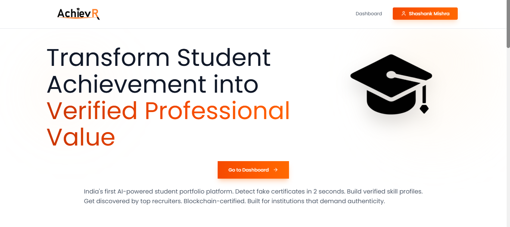
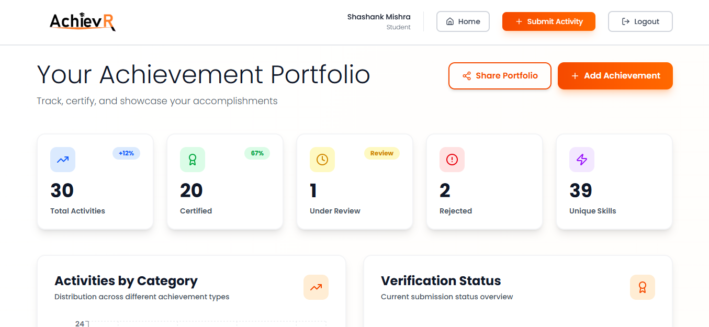
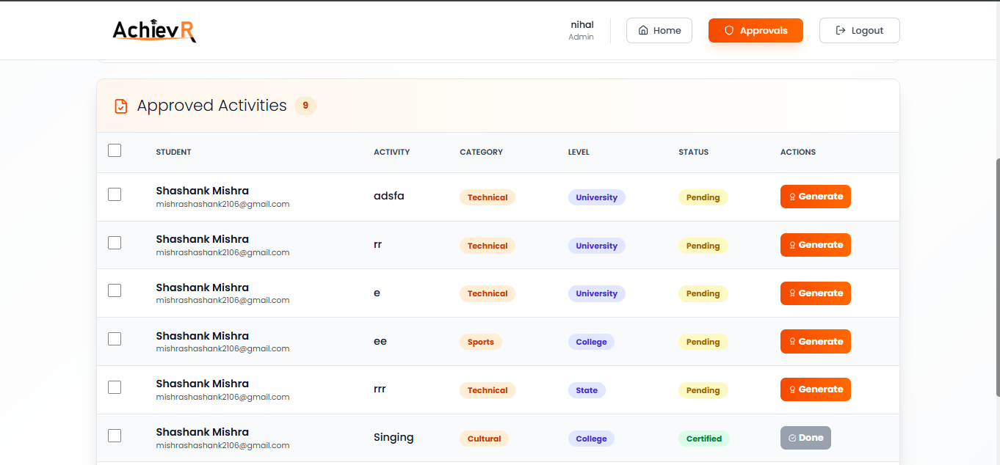
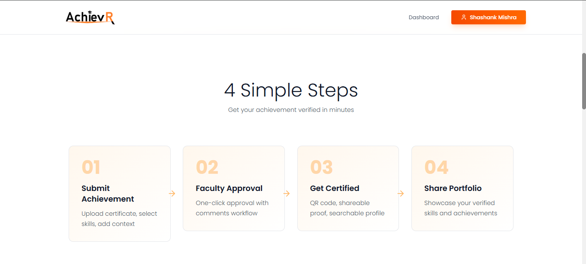

# AchievR - Student Achievement Verification Platform

> **Transform student achievements into verified, tamper-proof digital credentials — verified in 2 seconds, not 2 weeks**

[](https://dnvba07nlq4dm.cloudfront.net)
[](https://reactjs.org/)
[](https://nodejs.org/)
[](https://www.mongodb.com/)
[](https://aws.amazon.com/)
[](LICENSE)

---

## 🧩 What is AchievR?

AchievR is a production-ready, full-stack credential verification platform built for educational institutions. It eliminates manual certificate validation by providing **faculty-approved digital portfolios** with **QR-code verified certificates** - reducing verification time from weeks to **under 2 seconds**. It also acts as a **centralized platform where all achievement certificates are securely stored and easily accessible**.

> **Problem:** Students scatter achievements across emails & documents. Institutions spend weeks on manual verification for placements. Recruiters face fake certificate fraud in hiring.

> **Solution:** A single source of truth — faculty-verified portfolios, instant QR validation, and recruiter-facing shareable public profiles.

---
<!-- 
## 🖥️ Screenshots

| Landing Page | Student Dashboard |
|---|---|
|  |  |

| Certificate Generation | Call To Action |
|---|---|
|  |  |

--- -->

## ✨ Features

### 🎓 For Students
- **Unified Portfolio** - Submit and track academic, technical, sports & cultural achievements
- **Smart Skill Tagging** - 60+ predefined competencies + custom skill support
- **Instant QR Certificates** - Auto-generated upon faculty approval, publicly verifiable
- **Shareable Public Profile** - Unique portfolio URL (e.g. `/portfolio/:id`) for recruiters

### 🏛️ For Academic Institutions
- **Approval Workflow** — Review, approve or reject student submissions with proof document access
- **Multi-Role Dashboards** — Student / Faculty / Admin with JWT-based role-based access control

---

## 🛠️ Tech Stack

### Frontend
| Technology | Purpose |
|---|---|
| React 18 | Component-based UI |
| Tailwind CSS | Utility-first responsive design |
| React Router v6 | Client-side routing with protected routes |
| Recharts | Analytics & data visualizations |
| Axios | HTTP client for API communication |

### Backend
| Technology | Purpose |
|---|---|
| Node.js + Express.js | RESTful API server |
| MongoDB + Mongoose | NoSQL database with schema modeling |
| JWT + Bcrypt | Stateless authentication + password hashing |
| Multer | Proof document file upload handling |

### Infrastructure
| Technology | Purpose |
|---|---|
| AWS S3 | Frontend static hosting |
| AWS CloudFront | Global CDN with edge delivery |
| Render | Backend API deployment |

---

## 🚀 Getting Started

### 1. Clone the repository
git clone https://github.com/OmkarMishr/HackTitans-AchievR.git  
cd HackTitans-AchievR  

### 2. Backend Setup
cd backend  
npm install  
cp .env.example .env  
# Add your MongoDB URI, JWT_SECRET, and email credentials  
npm start  
# API running at http://localhost:5000  

### 3. Frontend Setup
cd ../frontend  
npm install  
npm run dev  
# App running at http://localhost:5174  

---

## 📁 Project Structure

```
HackTitans-AchievR/
├── backend/
│   ├── config/
│   │   └── db.js
│   ├── controllers/
│   │   ├── activity.controller.js
│   │   ├── auth.controller.js
│   │   ├── certificate.controller.js
│   │   └── recruiter.controller.js
│   ├── middleware/
│   │   └── auth.js
│   ├── models/
│   │   ├── Activity.js
│   │   ├── Certificate.js
│   │   ├── StudentSkills.js
│   │   └── User.js
│   ├── routes/
│   │   ├── activities.js
│   │   ├── auth.js
│   │   ├── certificates.js
│   │   ├── public.js
│   │   └── recruiter.js
│   ├── services/
│   │   └── certificateService.js
│   ├── .env
│   ├── .gitignore
│   ├── package.json
│   ├── package-lock.json
│   └── server.js
│
├── frontend/
│   ├── public/
│   ├── src/
│   │   ├── api/
│   │   │   └── apiClient.js
│   │   ├── assets/
│   │   ├── components/
│   │   │   ├── Landing/
│   │   │   │   ├── Animations.css
│   │   │   │   ├── CTA.jsx
│   │   │   │   ├── FAQ.jsx
│   │   │   │   ├── Footer.jsx
│   │   │   │   ├── Hero.jsx
│   │   │   │   ├── Navbar.jsx
│   │   │   │   ├── Problem.jsx
│   │   │   │   ├── Steps.jsx
│   │   │   │   └── Testimonials.jsx
│   │   │   ├── Student/
│   │   │   │   ├── AchievementDashboard.jsx
│   │   │   │   ├── PortfolioPreview.jsx
│   │   │   │   ├── Footer.jsx
│   │   │   │   ├── Navbar.jsx
│   │   │   │   └── SkillSelector.jsx
│   │   ├── pages/
│   │   │   ├── AdminDashboard.jsx
│   │   │   ├── FacultyDashboard.jsx
│   │   │   ├── Landing.jsx
│   │   │   ├── Login.jsx
│   │   │   ├── RecruiterPortfolio.jsx
│   │   │   ├── Register.jsx
│   │   │   ├── StudentDashboard.jsx
│   │   │   ├── StudentProfile.jsx
│   │   │   ├── SubmitActivity.jsx
│   │   │   ├── validateCertificate.jsx
│   │   │   └── VerifyCertificate.jsx
│   │   ├── services/
│   │   ├── App.css
│   │   ├── App.jsx
│   │   ├── index.css
│   │   └── main.jsx
│   ├── .env
│   ├── .env.production
│   ├── .gitignore
│   ├── eslint.config.js
│   ├── package.json
│   ├── package-lock.json
│   ├── vite.config.js
│   └── README.md
│
└── README.md
```

## 📡 API Reference

### 🔐 Auth APIs

| Method | Endpoint | Description |
|--------|----------|-------------|
| POST | `/api/auth/register` | Register new user (student/faculty) |
| POST | `/api/auth/login` | Login and get JWT token |
| GET | `/api/auth/me` | Get current logged-in user (protected) |
| POST | `/api/auth/logout` | Logout (client-side token removal) |

---

### 👤 User / Portfolio APIs

| Method | Endpoint | Description |
|--------|----------|-------------|
| GET | `/api/recruiter/profile/:id` | Get student portfolio (by ID or slug) |

---

### 📝 Activity APIs

| Method | Endpoint | Description | Auth |
|--------|----------|-------------|------|
| POST | `/api/activities/submit` | Submit new achievement | Student |
| GET | `/api/activities/my-activities` | Get logged-in user's activities | Student |
| PUT | `/api/activities/:id/approve` | Approve activity | Faculty |
| PUT | `/api/activities/:id/reject` | Reject activity | Faculty |
| GET | `/api/activities/pending` | Get all pending activities | Faculty |
| GET | `/api/activities/admin/all` | Get all activities | Admin |
| GET | `/api/activities/admin/approved` | Get approved activities | Admin |

---

### 🏆 Certificate APIs

| Method | Endpoint | Description |
|--------|----------|-------------|
| POST | `/api/certificates/generate/:activityId` | Generate certificate (PDF + S3 upload) |
| GET | `/api/certificates/download/:certificateId` | Download certificate PDF |
| GET | `/api/certificates/verify/:certificateId` | Verify certificate authenticity |
| GET | `/api/certificates/stats` | Get certificate statistics |

---

## 📌 Example — Register User

```json
POST /api/auth/register

{
  "name": "Shashank Mishra",
  "email": "shashank@email.com",
  "password": "123456",
  "role": "student",
  "rollNumber": "21CS101",
  "department": "CSE",
  "year": "3"
}
```

---

## 📌 Example — Login

```json
POST /api/auth/login

{
  "email": "shashank@email.com",
  "password": "123456"
}
```

---

## 📌 Example — Submit Activity

```json
POST /api/activities/submit
Authorization: Bearer <token>

{
  "title": "1st Place - National Hackathon",
  "description": "Built a full-stack credential platform in 24 hours",
  "category": "Technical",
  "eventDate": "2025-01-15",
  "organizingBody": "Government of India",
  "achievementLevel": "National",
  "selectedTechnicalSkills": ["React", "Node.js"],
  "selectedSoftSkills": ["Teamwork", "Leadership"],
  "selectedTools": ["Git", "Docker"]
}
```

---

## 📌 Example — Verify Certificate

```json
GET /api/certificates/verify/CERT_123456
```

Response:
```json
{
  "status": "valid",
  "data": {
    "certId": "CERT_123456",
    "student": "Shashank Mishra",
    "achievement": "National Hackathon Winner",
    "verifiedCount": 5
  }
}
```

---

## 🔐 Authentication

- Uses **JWT (JSON Web Token)**
- Token must be sent in headers:

```
Authorization: Bearer <your_token>
```

- Token contains:
  - `userId`
  - `role` (student / faculty / admin)

---

## ⚙️ Notes

- Activities must be **approved** before certificate generation  
- Certificates are:
  - Stored in **AWS S3**
  - **Tamper-proof**
  - Publicly verifiable via QR / ID  
- Skills are tracked and used to compute **student skill score**

---

## 📊 Impact

| Metric | Traditional | AchievR |
|--------|-------------|---------|
| Verification Time | 2–3 weeks | **< 2 seconds** |
| Certificate Authenticity | Manual, error-prone | **QR-verified, tamper-proof** |
| Student Portfolio Access | Scattered files | **Single public URL** |
| Institutional Reporting | Manual (days) | **Real-time dashboard** |

---

## 👥 Built By

| Name | Role | GitHub | LinkedIn |
|------|------|--------|----------|
| Shashank Mishra | Full Stack Developer | [@shashankmishra21](https://github.com/shashankmishra21) | [LinkedIn](https://www.linkedin.com/in/mishrashashank2106/) |
| Omkar Mishra | Full Stack Developer | [@OmkarMishr](https://github.com/OmkarMishr) | [LinkedIn](https://www.linkedin.com/in/omkar-mishra-b3677b246/) |

---

## 🤝 Contributing

git checkout -b feature/your-feature  
git commit -m "feat: describe your change"  
git push origin feature/your-feature  

---

## 📄 License

MIT License © 2025 Shashank Mishra & Omkar Mishra  

---

<div align="center">

⭐ Star this repo if AchievR impressed you!  

Built with ❤️ by Shashank Mishra & Omkar Mishra  

</div>